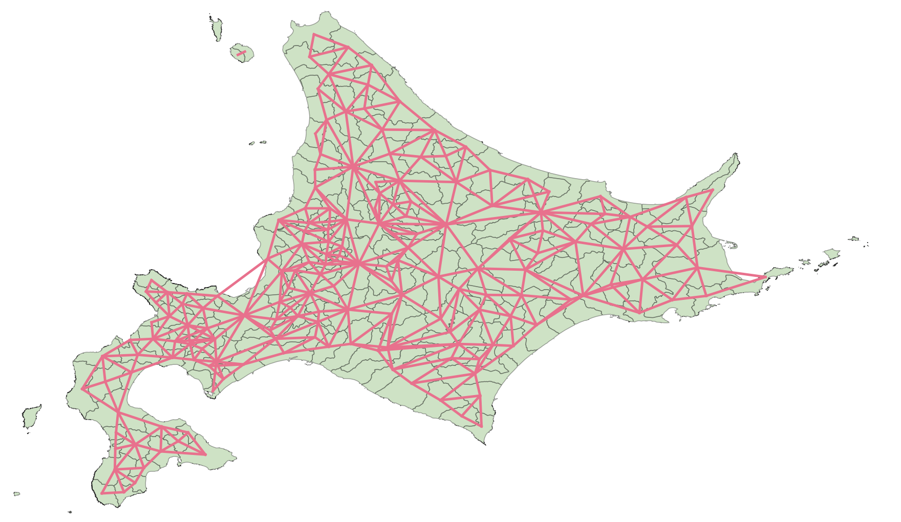
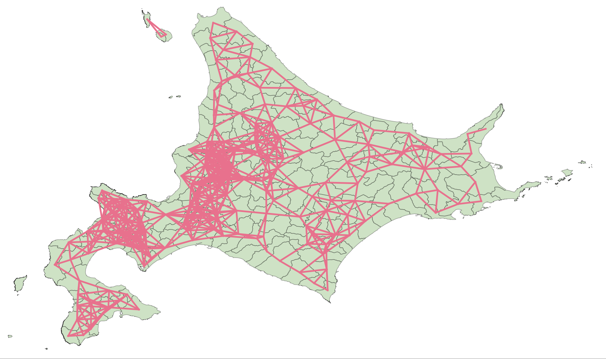
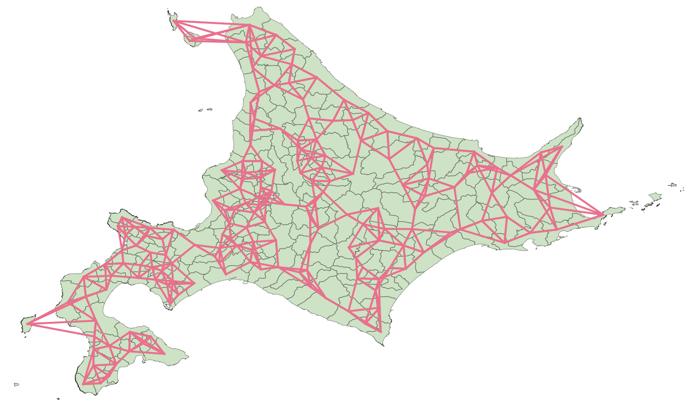
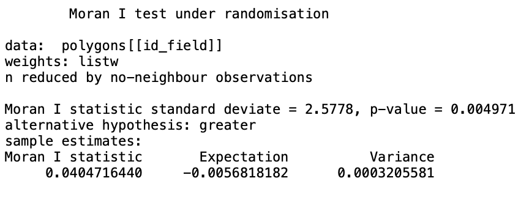
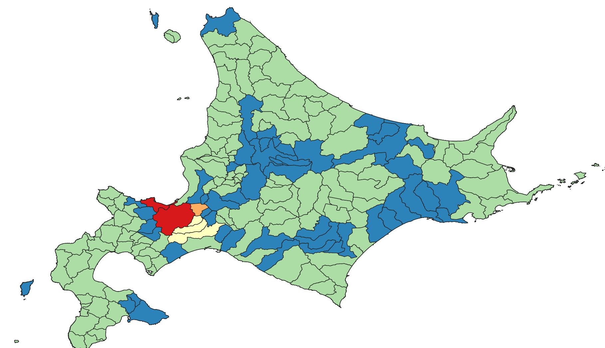
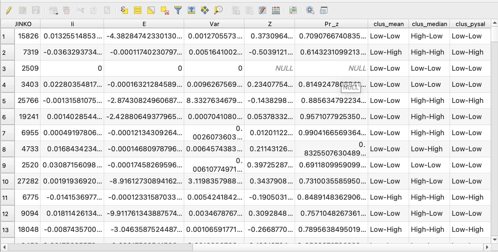

# R Spatial Statistics Plugin

## プラグイン概要

**R Spatial Statistics Plugin** は、QGIS 上で以下のような空間的近接関係に基づく **近接行列（Spatial Weight Matrix）** を生成できるプラグインです：

- **Queen型** / **Rook型** の隣接関係
- **距離ベース**（D-near Neighbors）
- **k近傍**（K-nearest neighbors）

さらに、**距離減衰（1/d）重み**のオプションを指定して、行基準化された空間重み行列を `.csv` として出力することも可能です。

また、空間自己相関統計量（GISA、LISA）の計算にも対応しています。

本プラグインは、内部的に **Rスクリプトと `spdep` パッケージ等**を用いて処理を行っています。
事前にRのインストールとQGIS上でのRのパスの設定が必要になります。

---

## 使い方

### 1. R のインストール

以下より **R** をインストールしてください（バージョン 4.2 以上を推奨）:

- [https://cran.r-project.org/](https://cran.r-project.org/)

### 2. Rscript のパスを QGIS に設定

QGIS メニューから：[設定] → [オプション] → [R Runner] タブ → Rscript のパスを指定

例（Windows）:C:\Program Files\R\R-4.3.1\bin\Rscript.exe

---

## 近接行列

以下のツールはすべて QGIS の「プロセシングツールボックス」から利用できます。

### Adjacency matrix

- ポリゴンレイヤを入力として、**クイーン型** または **ルーク型** のトポロジーに基づく近接行列を生成します。
- 生成される出力：
  - 近接を示すラインレイヤ（中心点同士の接続）
  - 近接情報付きのポリゴンレイヤ
  - `.csv` 形式の空間重み行列（オプション）

オプションで距離減衰（1/d）を有効にできます。

---

### Distance-based Nearest Neighbors

- ポリゴンまたはポイントの **重心** 座標に対して、
- **指定した距離範囲内（dmin 〜 dmax）** にある近傍を求めて、近接行列を構築します。
- 行基準化されたウェイト行列として `.csv` に出力されます。

---

### K-nearest Neighbors

- 各ジオメトリに対して、**最近傍k個の近傍**を検出し、近接行列を構築します。
- 特にポイントデータに適していますが、ポリゴンの重心でも動作します。
- 出力はラインレイヤ、ポリゴンレイヤ、重み行列（.csv）などです。

---

### 出力されるファイル

- `neighbor_lines`: 中心点間を結ぶラインレイヤ（可視化用）
- `neighbor_polygons`: 近接属性を付加したポリゴンレイヤ
- `weights.csv`: 行基準化された空間重み行列

---
## Global Indicators of Spatial Association (GISA)

- 入力レイヤと指定した属性をもとに、グローバル空間自己相関統計量を計算します。

- 対応する指標：
  - Global Moran’s I
  - Global Geary’s C
  - Global Getis-Ord G
  - Global Getis-Ord G*
- クイーン型、ルーク型、距離ベース、k近傍それぞれの近接方法に応じた統計量を計算可能です。
- 結果はプロセッシング結果パネルに表示され、必要に応じてテキストファイルとしてエクスポートも可能です。
---

## Local Indicators of Spatial Association (LISA)
- 入力レイヤと属性フィールドに基づき、各オブジェクト単位で局所的な空間自己相関統計量を計算します。

- 対応する指標：
  - Local Moran’s I
  - Local Getis-Ord G
  - Local Getis-Ord G*
- クイーン型、ルーク型、距離ベース、k近傍それぞれに対応しています。
- 出力は、統計量の値やクラスタ情報を付加したポリゴンレイヤとして保存されます。

出力される属性は以下の通りです。
- Local Moran’s I
  - Ii：ローカルモランI統計量
  - E：期待値。空間的にランダムだと仮定した時の理想的なローカルモランI統計量の平均。普通は0付近
  - Var：分散：期待値に対するばらつきの大きさ。どれくらいIiがランダムにぶれるかの指標
  - Z：Zスコア。E.Ii（期待されるランダム）と比べてIiがどれくらい離れているか
  - Pr_z：Zスコアに基づくP値
  - clus_mean：平均に基づくクラスタ分類
  - clus_median：中央値に基づくクラスタ分類
  - clus_pysal：PySALに基づくクラスタ分類
- Local Getis-Ord G
  - Gi：G統計量
  - Pr_z：P値
- Local Getis-Ord G*
  - Gi：G*統計量
  - Pr_z：P値
  - clus_pysal：クラスタ分類
---
## 必要なRパッケージ

初回実行時に自動インストールされますが、以下のパッケージが使用されます：

- `sf`
- `spdep`
- `dplyr`
- `classInt`

---

## ライセンス

GNU General Public License v2.0 またはそれ以降

---

# R Spatial Statistics Plugin

## Overview

The **R Spatial Statistics Plugin** for QGIS enables you to generate **spatial weight matrices** based on spatial proximity using:

- **Queen** and **Rook** adjacency (based on polygon topology)
- **Distance-based neighbors** (D-near)
- **K-nearest neighbors**

It also allows exporting a **row-standardized weights matrix** as a `.csv` file and optionally applying **distance-decay weights (1/d)**.

Internally, the plugin leverages **R** and packages such as `spdep` for spatial computations.

---

## Getting Started

### 1. Install R

Make sure R is installed on your system (version 4.2 or higher recommended):

- https://cran.r-project.org/

### 2. Set the Rscript path in QGIS

In QGIS:[Settings] → [Options] → [R Runner] tab → Specify Rscript path

Example (Windows):C:\Program Files\R\R-4.3.1\bin\Rscript.exe

---

## Adjacency Matrix Tools

All tools are available via the QGIS **Processing Toolbox**.

### Adjacency Matrix

- Computes a spatial weight matrix using **Queen** or **Rook** adjacency rules based on polygon topology.
- Outputs include:
  - A line layer connecting neighboring feature centroids
  - A polygon layer with neighbor attributes
  - An optional CSV file containing a row-standardized weights matrix

Distance-decay weights can be enabled optionally.

---

### Distance-based Nearest Neighbors

- Calculates neighbors within a specified **distance range (dmin to dmax)** based on centroid coordinates.
- Outputs a proximity matrix with optional CSV export.

---

### K-nearest Neighbors

- Computes neighbors based on the **k nearest** features to each input geometry (e.g., centroids).
- Suitable for both polygons and point layers.
- Outputs include a line layer, polygon layer, and weights CSV

---

### Output Files

- `neighbor_lines.gpkg`: Line layer showing centroid connections
- `neighbor_polygons.gpkg`: Polygons with neighbor ID and count attributes
- `weights.csv`: Row-standardized spatial weight matrix

---

## Global Indicators of Spatial Association (GISA)

- Calculates global spatial autocorrelation statistics for a given attribute field of the input layer.

- Supported statistics:
  - Global Moran’s I
  - Global Geary’s C
  - Global Getis-Ord G
  - Global Getis-Ord G*
- The computation adapts to the selected neighbor method (Queen, Rook, Distance-based, K-nearest).
- Results are displayed in the Processing log and optionally exported as a .txt file.

---

## Local Indicators of Spatial Association (LISA)
- Calculates local spatial autocorrelation statistics for each feature based on a given attribute field.

- Supported statistics:
  - Local Moran’s I
  - Local Getis-Ord G
  - Local Getis-Ord G*
- Compatible with Queen/Rook, Distance-based, and K-nearest neighbor methods.
- Outputs a new polygon layer with statistical results.

Output attribute fields
- Local Moran’s I
  - Ii：Local Moran窶冱 I statistic value
  - E：Expected value of Ii
  - Var：Variance of Ii
  - Z：Z-score
  - Pr_z：p-value corresponding to Z
  - clus_mean：Cluster classification based on mean (e.g., Low-Low)
  - clus_median：Cluster classification based on median
  - clus_pysal：Cluster classification based on PySAL rules
- Local Getis-Ord G
  - Gi：Local Getis-Ord G statistic value
  - Pr_z：P value
- Local Getis-Ord G*
  - Gi：Local Getis-Ord G* statistic value
  - Pr_z：Pvalue
  - clus_pysal：Hot spot / Cold spot classification for G*

---

## Required R Packages

These are automatically installed on first run if not already available:

- `sf`
- `spdep`
- `dplyr`
- `classInt`

---

## License

This plugin is licensed under the **GNU General Public License v2.0** or later.

---
