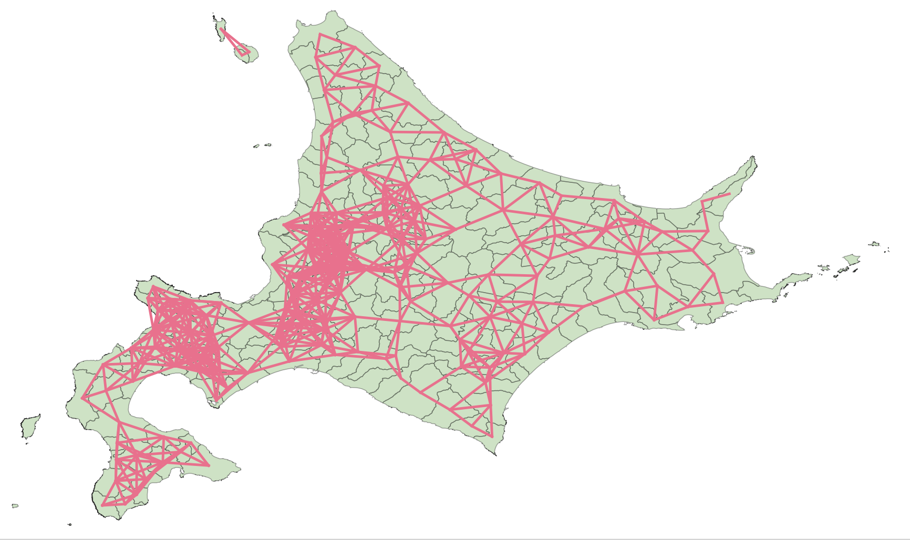
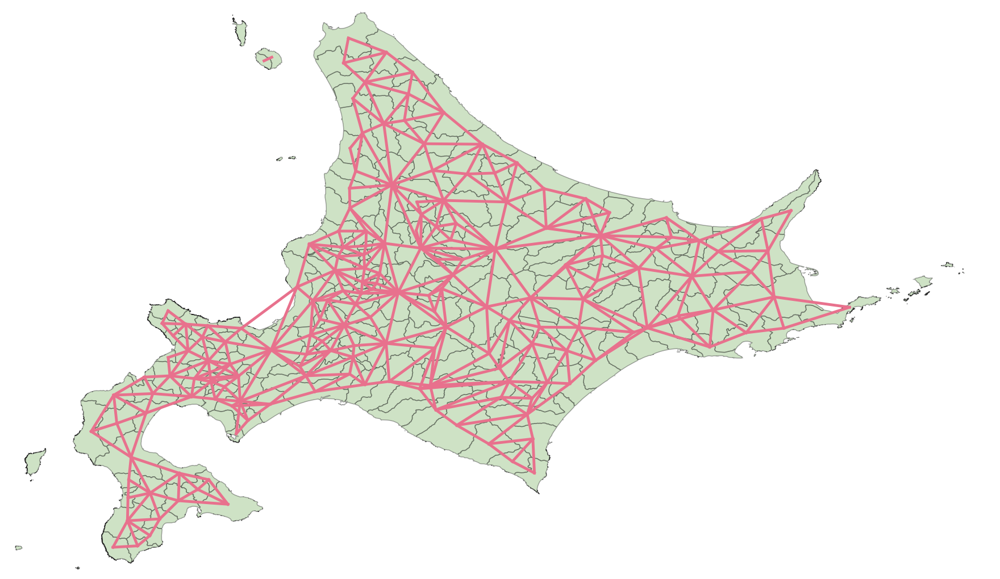

# R Spatial Statistics Plugin

## プラグイン概要

**R Spatial Statistics Plugin** は、QGIS 上で以下のような空間的近接関係に基づく **近接行列（Spatial Weight Matrix）** を生成できるプラグインです：

- **Queen型** / **Rook型** の隣接関係
- **距離ベース**（D-near Neighbors）
- **k近傍**（K-nearest neighbors）

さらに、**距離減衰（1/d）重み**のオプションを指定して、行基準化された空間重み行列を `.csv` として出力することも可能です。

本プラグインは、内部的に **Rスクリプトと `spdep` パッケージ等**を用いて処理を行っています。

---

## 使い方

### 1. R のインストール

以下より **R** をインストールしてください（バージョン 4.2 以上を推奨）:

- [https://cran.r-project.org/](https://cran.r-project.org/)

### 2. Rscript のパスを QGIS に設定

QGIS メニューから：[設定] → [オプション] → [R Runner] タブ → Rscript のパスを指定

例（Windows）:C:\Program Files\R\R-4.3.1\bin\Rscript.exe

---

## プロセッシングツールの説明

以下のツールはすべて QGIS の「プロセシングツールボックス」から利用できます。

### Adjacency matrix

- ポリゴンレイヤを入力として、**クイーン型** または **ルーク型** のトポロジーに基づく近接行列を生成します。
- 生成される出力：
  - 近接を示すラインレイヤ（中心点同士の接続）
  - 近接情報付きのポリゴンレイヤ
  - `.csv` 形式の空間重み行列（オプション）

オプションで距離減衰（1/d）を有効にできます。

---

### Distance-based Nearest Neighbors

- ポリゴンまたはポイントの **重心** 座標に対して、
- **指定した距離範囲内（dmin 〜 dmax）** にある近傍を求めて、近接行列を構築します。
- 行基準化されたウェイト行列として `.csv` に出力されます。

---

### K-nearest Neighbors

- 各ジオメトリに対して、**最近傍k個の近傍**を検出し、近接行列を構築します。
- 特にポイントデータに適していますが、ポリゴンの重心でも動作します。
- 出力はラインレイヤ、ポリゴンレイヤ、重み行列（.csv）などです。

---

## 出力されるファイル

- `neighbor_lines`: 中心点間を結ぶラインレイヤ（可視化用）
- `neighbor_polygons`: 近接属性を付加したポリゴンレイヤ
- `weights.csv`: 行基準化された空間重み行列

---

## 必要なRパッケージ

初回実行時に自動インストールされますが、以下のパッケージが使用されます：

- `sf`
- `spdep`
- `dplyr`
- `classInt`

---

## ライセンス

GNU General Public License v2.0 またはそれ以降

---

# R Spatial Statistics Plugin

## Overview

The **R Spatial Statistics Plugin** for QGIS enables you to generate **spatial weight matrices** based on spatial proximity using:

- **Queen** and **Rook** adjacency (based on polygon topology)
- **Distance-based neighbors** (D-near)
- **K-nearest neighbors**

It also allows exporting a **row-standardized weights matrix** as a `.csv` file and optionally applying **distance-decay weights (1/d)**.

Internally, the plugin leverages **R** and packages such as `spdep` for spatial computations.

---

## Getting Started

### 1. Install R

Make sure R is installed on your system (version 4.2 or higher recommended):

- https://cran.r-project.org/

### 2. Set the Rscript path in QGIS

In QGIS:[Settings] → [Options] → [R Runner] tab → Specify Rscript path

Example (Windows):C:\Program Files\R\R-4.3.1\bin\Rscript.exe

---

## Description of Processing Tools

All tools are available via the QGIS **Processing Toolbox**.

### Adjacency Matrix

- Computes a spatial weight matrix using **Queen** or **Rook** adjacency rules based on polygon topology.
- Outputs include:
  - A line layer connecting neighboring feature centroids
  - A polygon layer with neighbor attributes
  - An optional CSV file containing a row-standardized weights matrix

Distance-decay weights can be enabled optionally.

---

### Distance-based Nearest Neighbors

- Calculates neighbors within a specified **distance range (dmin to dmax)** based on centroid coordinates.
- Outputs a proximity matrix with optional CSV export.

---

### K-nearest Neighbors

- Computes neighbors based on the **k nearest** features to each input geometry (e.g., centroids).
- Suitable for both polygons and point layers.
- Outputs include a line layer, polygon layer, and weights CSV

---

## Output Files

- `neighbor_lines.gpkg`: Line layer showing centroid connections
- `neighbor_polygons.gpkg`: Polygons with neighbor ID and count attributes
- `weights.csv`: Row-standardized spatial weight matrix

---

## Required R Packages

These are automatically installed on first run if not already available:

- `sf`
- `spdep`
- `dplyr`
- `classInt`

---

## License

This plugin is licensed under the **GNU General Public License v2.0** or later.

---
